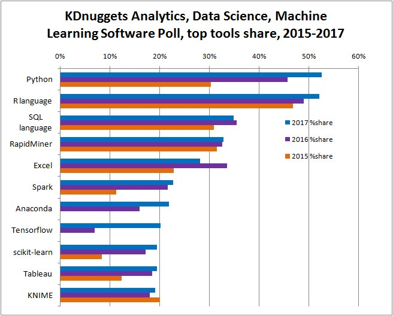

# Africalics-PhD-Academy-2018
Methods workshop at the Africalics 2018 PhD Academy, Marrakesh 

Dr. Daniel S. Hain, dsh@business.aau.dk
Dr. Roman Jurowetzki, roman@business.aau.dk

Aalborg University, Denmark

---

In this repository, you will find all notebooks, presentations and materials from the workshop. We will also use it to link to the Kaggle kernels that will be used in the interactive exercises.

Please register on [kaggle.com](https://www.kaggle.com) to follow the exercises.

In this workshop, we will not teach you one particular trending method or approach but rather introduce to Data Science as a field and its approach to working with data.

Sure, we can only do so much in 3 days, and therefore we tried to find a good balance of broad overview and specific applications.

Hopefully, this will give you a good foundation or at least starting point to learn more. Today, it is really easy to find excellent resources and get skilled at sophistic analytical techniques. But, you need to know what to look for and how all the different things out there relate to each other. 

While for several reasons – mostly path dependancy – the innovation studies (and general social science) community are relying on expensive proprietory packages (e.g. SPSS, Stata, SAS or EViews), the people that work with *Big Data* analytics are working with R and/or Python. We decided not to focus on just one language but will present you both so you can decide which one you find most approachable.

Below you will find links to the different things presented during the workshop. We will update this repository during and after the workshop.

---

# Day 1: Intro and Data Preprocessing

## Session 1 - Introduction
[Slides]()

## Session 2 - Data Munging
[Notebook]()

[Notebook (Kaggle) executable](https://www.kaggle.com/danielhain/africalics-2018-session1-data-munging?scriptVersionId=5948122)

# Day 2: Unsupervised and Supervised Machine Learning

# Day 3: Natural Language Processing
